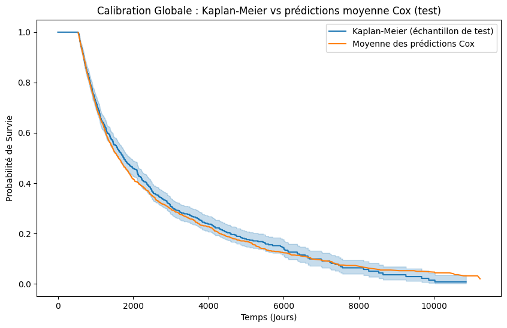
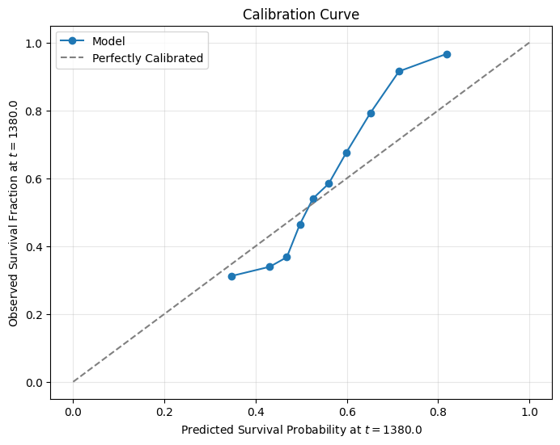
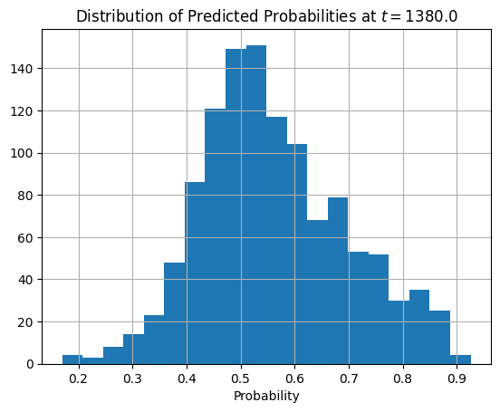

# Rapport Technique : Analyse de Survie et Prédiction Conforme (Projet SigBERT)

**Auteurs :** Mathis Derenne, Djida Boukari, Ines Nakhli  
**Date :** 05 Février 2026

---

## 1. Introduction et Contexte

Ce rapport s'inscrit dans le cadre du projet **SigBERT**, qui explore une approche novatrice de la modélisation du risque patient. L'objectif est de prédire la survie à partir de "signatures" mathématiques complexes dérivées d'embeddings de textes cliniques (OncoBERT).

Alors que les modèles de survie classiques (Cox, etc.) se concentrent souvent sur le classement des patients par niveau de risque (ranking) ou l'estimation d'une probabilité moyenne, ce projet vise une étape supplémentaire : **la quantification de l'incertitude**. Pour ce faire, nous couplons des techniques de Machine Learning avancées à la **Prédiction Conforme**, afin de fournir des intervalles de prédiction assortis de garanties statistiques de couverture, un atout majeur pour la prise de décision clinique.

## 2. Analyse Exploratoire et Prétraitement des Données

### 2.1 Description des Données
L'étude repose sur le jeu de données `df_study_L18_w6`, comportant **3555 patients**.
*   **Covariables** : 756 caractéristiques issues des signatures de chemins (path signatures), capturant la dynamique séquentielle des données médicales.
*   **Cible** : Le temps de survie $T$ et l'indicateur d'événement $\delta$ (décès vs censure).
*   **Censure** : Environ **33%** des données sont censurées à droite (patients perdus de vue ou fin d'étude).
*   **Survie médiane** : 1329 jours.

### 2.2 Stratégie de Prétraitement
Face à la haute dimensionnalité des signatures (756 variables) par rapport au nombre d'observations, une réduction de dimension s'est avérée nécessaire pour éviter le sur-apprentissage et les problèmes de convergence.

1.  **Standardisation** : Centrage et réduction des variables.
2.  **PCA (Analyse en Composantes Principales)** : Conservation des composantes expliquant **90% de la variance** totale.
3.  **Partitionnement** : Séparation stratifiée (sur l'événement) en ensembles d'Entraînement, de Test, et une subdivision spécifique "Calibration" pour l'approche conforme.

## 3. Modélisation de Survie Comparée

Nous avons évalué un panel de modèles représentatifs de l'état de l'art en analyse de survie.

### 3.1 Modèles Évalués
*   **Modèle de Cox Pénalisé** : Référence statistique classique. Une recherche par grille (Grid Search) a identifié la régularisation **ElasticNet** (mélange L1/L2, ratio 0.5, pénalité 0.1) comme optimale.
*   **Survival SVM** : Approche à noyaux pour maximiser la marge de séparation.
*   **Random Survival Forest (RSF)** : Méthode d'ensemble gérant bien les non-linéarités.
*   **Gradient Boosting Survival (GBM)** : Boosting optimisant la vraisemblance partielle.
*   **XGBoost AFT (Accelerated Failure Time)** : Modèle paramétrique flexible prédisant directement le logarithme du temps de survie.

### 3.2 Focus : Analyse Détaillée du Modèle de Cox
Bien que le modèle de Cox ne soit pas le plus performant en termes de discrimination pure, il reste la référence (baseline) en analyse de survie. Une attention particulière a été portée à son entraînement et à son analyse :

*   **Optimisation des Hyperparamètres** : Une recherche par grille (Grid Search) avec validation croisée (k=2) a été menée sur le coefficient de pénalité (`penalizer`) et le ratio ElasticNet (`l1_ratio`). Le meilleur modèle combine une pénalité modérée ($0.1$) et une régularisation ElasticNet équilibrée ($L1\_ratio=0.5$), suggérant que la sélection de variables (L1) et la gestion de la colinéarité (L2) sont toutes deux nécessaires pour ces signatures de haute dimension.
    
    

*   **Calibration Globale** : L'analyse graphique montre un alignement excellent entre la courbe de survie moyenne prédite par Cox et l'estimateur non-paramétrique de Kaplan-Meier sur l'ensemble de test. Le modèle ne présente pas de biais systématique (pas d'optimisme ou de pessimisme global).

    

*   **Calibration Locale (Fiabilité)** : La courbe de calibration par bins à la médiane temporelle confirme cette fiabilité. Les probabilités prédites correspondent bien aux fréquences observées (points proches de la diagonale), avec une légère tendance à sous-estimer la survie pour les probabilités très élevées ($>0.8$).

    

*   **Discrimination** : La distribution des probabilités de survie à la médiane est large (de $0.2$ à $0.8$), ce qui indique que le modèle parvient bien à distinguer les profils à risque, ne se contentant pas de prédictions moyennes.

    

### 3.3 Résultats et Benchmark

| Modèle | C-index (Discrimination) | IBS (Calibration) | Commentaire |
| :--- | :--- | :--- | :--- |
| **Survival SVM** | **0.73** | - | Meilleur pour classer les patients (ranking). |
| **XGBoost AFT** | 0.72 | - | Excellente performance, permet une prédiction directe du temps. |
| **Gradient Boosting** | 0.72 | **0.18** | Meilleure calibration probabiliste. |
| **Random Forest** | 0.72 | 0.17 | Très robuste. |
| **Cox ElasticNet** | 0.70 | 0.20 | En retrait, suggérant des non-linéarités complexes dans les signatures. |

**Conclusion de la modélisation** : Si l'objectif est le classement pur, le SVM est préconisé. Pour la calibration probabiliste, le Gradient Boosting domine. Pour la prédiction conforme (ci-dessous), **XGBoost AFT** a été retenu car sa formulation ($\log T \sim f(X)$) facilite la construction naturelle d'intervalles de temps.

## 4. Prédiction Conforme en Analyse de Survie

L'objectif est de construire un intervalle $\hat{C}(X)$ tel que $P(T \in \hat{C}(X)) \geq 1 - \alpha$.

### 4.1 Le Défi de la Censure
La prédiction conforme standard (Split Conformal) est mise en échec par la censure. Pour un patient censuré à $C_i$, nous ne connaissons pas le vrai résidu $|T_i - \hat{T}_i|$ car $T_i$ est inconnu. Ignorer les censurés créerait un biais massif vers les décès précoces.

### 4.2 Méthodologie : Weighted Split Conformal Prediction (WSCP)
Nous avons implémenté une approche pondérée (IPCW - *Inverse Probability of Censoring Weighting*).

1.  **Estimation de la Censure** : Un estimateur de Kaplan-Meier est ajusté sur la variable de censure $C$ pour obtenir $\hat{G}(t) = P(C > t)$.
2.  **Calcul des Scores** : Sur l'ensemble de calibration, pour les non-censurés, le score de non-conformité est le résidu log-absolu :
    $$s_i = |\log(T_i) - \log(\hat{T}_{AFT}(X_i))|$$
3.  **Pondération** : Chaque score reçoit un poids $w_i = \frac{1}{\hat{G}(T_i)}$. Cela "sur-pondère" les décès tardifs qui sont statistiquement sous-représentés à cause de la censure.
4.  **Quantile Pondéré** : On calcule le quantile pondéré $1-\alpha$ des scores, noté $\hat{q}$.

### 4.3 Résultats de la Prédiction Conforme

Pour une cible de couverture de **90%** ($\alpha = 0.1$) :

*   **Quantile Conforme ($\hat{q}$)** : 1.2088.
    *   *Interprétation* : L'incertitude correspond à un facteur multiplicatif d'environ **3.35x** ($\exp(1.21)$) autour de la prédiction médiane.
*   **Couverture Observée** : **91.9%**.
    *   Mesurée sur les patients non-censurés du test set. La condition de validité marginale ($ \ge 90\%$) est respectée.
*   **Largeur Médiane des Intervalles** : **6504 jours**.

## 5. Conclusion et Perspectives

L'approche conforme a permis de transformer les prédictions ponctuelles du modèle XGBoost AFT en intervalles de confiance valides.
*   **Validité** : La méthode WSCP corrige efficacement le biais de censure, atteignant la couverture cible.
*   **Incertitude** : La largeur importante des intervalles (médiane > 6000 jours) révèle la difficulté intrinsèque de prédire le temps exact de survie à partir des signatures seules, malgré un C-index correct (0.72). Le signal prédictif permet de bien *classer* les risques (discrimination), mais reste bruité pour *dater* l'événement avec précision.

Ces résultats soulignent l'importance de ne pas se fier uniquement aux scores de risque ponctuels en clinique, mais de considérer l'incertitude associée.
